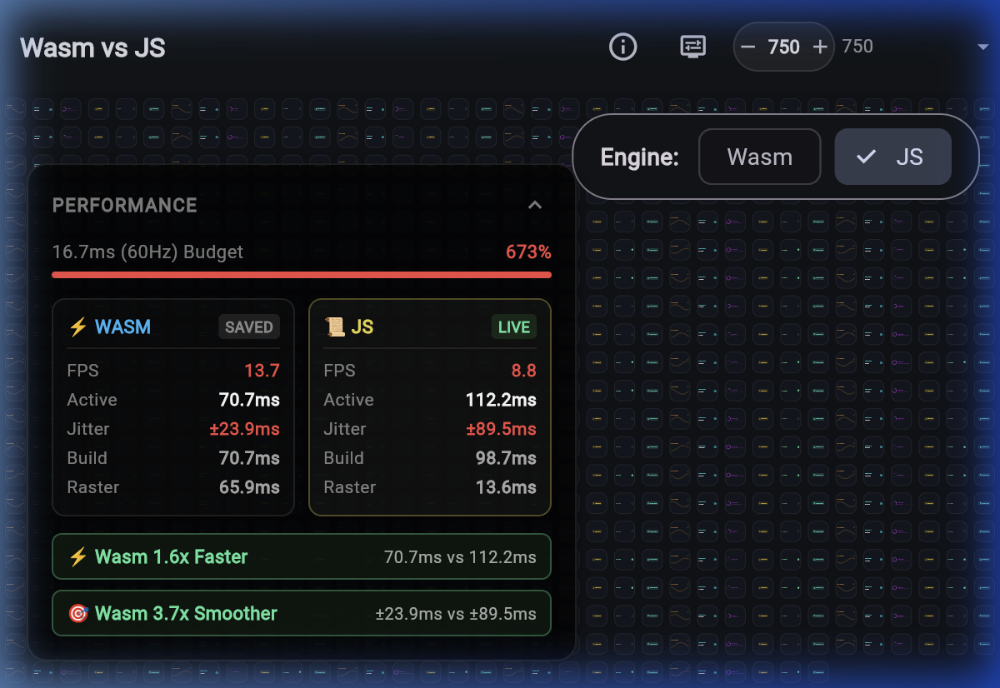

# Flutter WebAssembly vs JavaScript Comparison

An interactive, responsive performance benchmark comparing Flutter compiled to
**WebAssembly (Wasm/Skwasm)** against **JavaScript (CanvasKit)**.

**Live Demo**: [https://flutter-wasm-compare.web.app](https://flutter-wasm-compare.web.app)



---

## Why WebAssembly?

Flutter Web with WebAssembly brings multithreaded rendering and direct Dart
compilation to modern web browsers:

- **Higher Throughput**: Dedicated Web Worker rasterization decouples the UI
  build thread from graphics rendering, enabling parallel frame pipelining.
- **Smoother Frame Pacing**: Near-zero frame jitter and consistent delivery,
  even under heavy UI churn and complex layouts.
- **Direct WasmGC Execution**: Native execution avoids JavaScript JIT warmup
  and runtime overhead.

---

## Features

- **Side-by-Side Performance HUD**: Dedicated dual mini-cards displaying
  real-time metrics comparing Wasm (left) against JS (right):
  - **FPS**: Framerate calculation ignoring inactive tab pauses.
  - **Active Time**: Critical-path execution time ($\max(\text{build}, \text{raster})$
    for multithreaded Wasm vs $\text{build} + \text{raster}$ for serial JS).
  - **Jitter**: Standard deviation of inter-frame arrival intervals.
  - **Build & Raster**: Granular breakdown of Dart widget builds and GPU
    rasterization.
- **Real-Time Benefit Badges**: Live indicators highlighting Wasm gains:
  - `⚡ Wasm Nx Faster`: Multiplier comparing active frame time throughput.
  - `🎯 Wasm Nx Smoother`: Multiplier comparing frame pacing stability.
- **Polymorphic Morphing Matrix**: Configurable workload testing animated
  waveforms, gauges, progress indicators, and custom shapes.
- **Flexible Stress Controls**: Step decade increments with `-` / `+` or choose
  from quick presets (Light, Medium, Heavy, Max).
- **Responsive Layout**: Adapts between compact single-column mobile viewports
  and widescreen multi-column desktop grids.
- **Persisted State**: Benchmark measurements and HUD preferences persist
  across runtime engine reloads.

---

## Requirements for WebAssembly

Flutter WebAssembly multi-threading requires `SharedArrayBuffer` support.
Web servers hosting the application must set the following HTTP response
headers:

- `Cross-Origin-Opener-Policy: same-origin`
- `Cross-Origin-Embedder-Policy: require-corp`

---

## Development

### Run Locally

Use the local Dart development server to serve the build with required
COOP/COEP headers:

```bash
# Build WASM and serve locally on port 8088
dart run tool/serve.dart --port 8088
```

### Build for Production

```bash
flutter build web --wasm --source-maps --dump-info
```

### Deploy to Firebase Hosting

```bash
firebase deploy --only hosting
```
